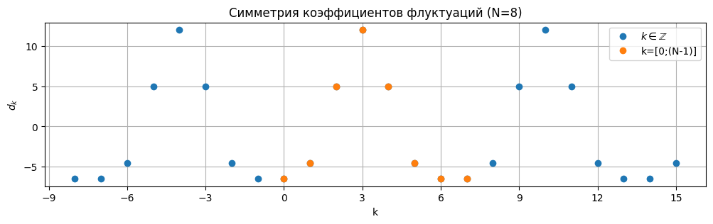

# Daub 5/3 integer-to-integer system

## Обычное разложение
Задан вектор $f$ размера ${N}$.

Согласно книге [1] (стр.76) коэффициенты Daub 5/3-разложения при индексации ${k=[1;N]}$:

$$\begin{align}
    a_k &= \cfrac{-1}{8} f_{2k-3} + \cfrac{1}{4} f_{2k-2} + \cfrac{3}{4} f_{2k-1} + \cfrac{1}{4} f_{2k} + \cfrac{-1}{8} f_{2k+1}, \\
    d_k &= \cfrac{-1}{2} f_{2k-1} + f_{2k} + \cfrac{-1}{2} f_{2k+1},
\end{align}$$

где $a$ - тренд, $d$ - флуктуации.

Значения вектора $f$ в граничных точках определяются по правилу "even symmetry": ${f_0=f_2}$, ${f_{-1}=f_{3}}$ и ${f_{N+1}=f_{N-1}}$, ${f_{N+2}=f_{N-2}}$.

В случае индексации от ${k=0}$:

$$\begin{align}
    a_k &= \cfrac{-1}{8} f_{2k-2} + \cfrac{1}{4} f_{2k-1} + \cfrac{3}{4} f_{2k} + \cfrac{1}{4} f_{2k+1} + \cfrac{-1}{8} f_{2k+2}, \\
    d_k &= \cfrac{-1}{2} f_{2k} + f_{2k+1} + \cfrac{-1}{2} f_{2k+2},
\end{align}$$

где ${f_{-1}=f_1}$, ${f_{-2}=f_{2}}$, ${f_{N}=f_{N-2}}$, ${f_{N+1}=f_{N-3}}$ и т.д.

## Lifting forms

Lifting-метод основан на последовательном попарном вычислении коэффициентов разложения: для каждого $k$ вычисляется пара ${a_k}$, ${d_k}$, причем первым вычисляется коэффициент ${d_k}$ и это значение используется при вычислении ${a_k}$.

С учетом равенства

$$\begin{equation}
    d_{k-1} = \cfrac{-1}{2} f_{2k-3} + f_{2k-2} + \cfrac{-1}{2} f_{2k-1},
\end{equation}$$

сумма

$$\begin{equation}
    \left( d_{k-1} + d_{k} \right) = \cfrac{-1}{2} f_{2k-3} + f_{2k-2} + (-1) f_{2k-1} + f_{2k} + \cfrac{-1}{2} f_{2k+1}.
\end{equation}$$

Коэффициенты ${a_k}$ представляются следующей линейной комбинацией:

$$\begin{equation}
    a_k = f_{2k-1} + \cfrac{1}{4} \left( d_{k-1} + d_{k} \right).
\end{equation}$$

Результирующие выражения для ${d_k}$ и ${a_k}$ при индексации ${k=[1;N]}$:

$$\begin{align}
    d_k &= f_{2k} - \cfrac{1}{2} \left( f_{2k-1} + f_{2k+1} \right), \\
    a_k &= f_{2k-1} + \cfrac{1}{4} \left( d_{k-1} + d_{k} \right).
\end{align}$$

Формулы обратного преобразования:

$$\begin{align}
    f_{2k-1} &= a_{k} - \cfrac{1}{4} \left( d_{k-1} + d_{k} \right), \\
    f_{2k} &= d_{k} + \cfrac{1}{2} \left( f_{2k-1} + f_{2k+1} \right).
\end{align}$$

Полученные выражения совпадают с приведенными в книге [1] (стр.78).

### Индексация от ${k=0}$

В случае индексации от ${k=0}$ выражения принимают вид:

$$\begin{align}
    d_k &= f_{2k+1} - \cfrac{1}{2} \left( f_{2k} + f_{2k+2} \right), \\
    a_k &= f_{2k} + \cfrac{1}{4} \left( d_{k-1} + d_{k} \right).
\end{align}$$

$$\begin{align}
    f_{2k} &= a_{k} - \cfrac{1}{4} \left( d_{k-1} + d_{k} \right), \\
    f_{2k+1} &= d_{k} + \cfrac{1}{2} \left( f_{2k} + f_{2k+2} \right).
\end{align}$$

Именно эти формулы, с учетом значений 1-го шага, использованы в работе.

### Проблема 1-го шага

Вычисляя коэффициенты lifting-методом возникает неопределенность в значении ${d_{k-1}}$ при ${k=0}$. С целью разрешить эту неопределенность проведено исследование значений коэффициентов флуктуации в широком диапазоне $k$, включая ${k<0}$.

**Вывод:** ${d_{-1} = d_0}$.

Следовательно, коэффициенты ${a_k}$ вычисляются по формулам:

$$a_k=f_{2k}+
\begin{cases}
\begin{aligned}
    d_{k}&/2, &k=0, \\
    \left( d_{k-1} + d_{k} \right)&/4, &k>0.
\end{aligned}
\end{cases}$$

Четные значения вектора $f$ вычисляются по формулам:

$$f_{2k}=a_{k}-
\begin{cases}
\begin{aligned}
    d_{k}&/2, &k=0, \\
    \left( d_{k-1} + d_{k} \right)&/4, &k>0.
\end{aligned}
\end{cases}$$

## Daub 5/3 integer-to-integer system
В книге [1] предложены следующие формулы:

$$\begin{align}
    d_k &= f_{2k} - \left \lfloor \cfrac{1}{2} \left( f_{2k-1} + f_{2k+1} \right) + \cfrac{1}{2} \right \rfloor, \\
    a_k &= f_{2k-1} + \left \lfloor \cfrac{1}{4} \left( d_{k-1} + d_{k} \right) + \cfrac{1}{2} \right \rfloor,
\end{align}$$

$$\begin{align}
    f_{2k-1} &= a_{k} - \left \lfloor \cfrac{1}{4} \left( d_{k-1} + d_{k} \right) + \cfrac{1}{2} \right \rfloor, \\
    f_{2k} &= d_{k} + \left \lfloor \cfrac{1}{2} \left( f_{2k-1} + f_{2k+1} \right) + \cfrac{1}{2} \right \rfloor.
\end{align}$$

где ${\lfloor x + 1/2 \rfloor}$ - операция округления до ближайшего целого числа.

Такая форма записи предполагает промежуточные float-операции, несмотря на целочисленность $f$, $a$, $d$.

В качестве альтернативы предполагается использовать следующую форму записи:

$$\begin{align}
    d_k &= f_{2k} - \left( f_{2k-1} + f_{2k+1} + 1 \right) // 2, \\
    a_k &= f_{2k-1} + \left( d_{k-1} + d_{k} + 2 \right) // 4,
\end{align}$$

$$\begin{align}
    f_{2k-1} &= a_{k} - \left( d_{k-1} + d_{k} + 2 \right) // 4, \\
    f_{2k} &= d_{k} + \left( f_{2k-1} + f_{2k+1} + 1 \right) // 2.
\end{align}$$

где ${//}$ - операция целочисленного деления (остаток от деления отбрасывается).

Предложенная форма записи предполагает применение исключительно целочисленной арифметики.

В случае индексации от ${k=0}$ выражения принимают вид:

$$\begin{align}
    d_k &= f_{2k+1} - \left( f_{2k} + f_{2k+2} + 1 \right) // 2, \\
    a_k &= f_{2k} + \left( d_{k-1} + d_{k} + 2 \right) // 4,
\end{align}$$

$$\begin{align}
    f_{2k} &= a_{k} - \left( d_{k-1} + d_{k} + 2 \right) // 4, \\
    f_{2k+1} &= d_{k} + \left( f_{2k} + f_{2k+2} + 1 \right) // 2.
\end{align}$$

## Reference
1. James S. Walker. A Primer on Wavelets and Their Scientific Applications. 2nd Edition. 2008.
2. [Calderbank A.R. Wavelet transforms that map integers to integers // Applied and Computational Harmonic Analysis Volume 5, Issue 3, July 1998, Pages 332-369.](https://www.sciencedirect.com/science/article/pii/S1063520397902384)
3. [Wim Sweldens. The Lifting Scheme: A Custom-Design Construction of Biorthogonal Wavelets // Applied and Computational Harmonic Analysis Volume 3, Issue 2, April 1996, Pages 186-200.](https://www.sciencedirect.com/science/article/pii/S1063520396900159)